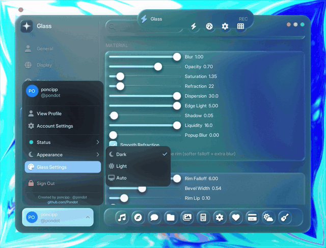
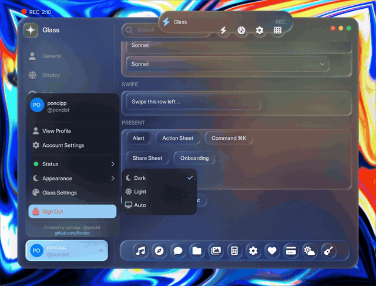

# liquidDX11

**Source release - real-time desktop glass for Dear ImGui.**

`liquidDX11` is a native Windows demo that turns a borderless Dear ImGui window
into a refractive, glossy glass overlay rendered in Direct3D 11. It captures the
live desktop with DXGI Desktop Duplication, runs a Dual Kawase blur chain, and
draws spring-animated glass UI on top with custom HLSL shaders.

## Preview






[Watch the full preview on YouTube](https://www.youtube.com/watch?v=rWdHt9bqKjY)

## Note

This is a source release, not a packaged SDK. The original app code is MIT
licensed and can be used for non-commercial or commercial projects. Dear ImGui,
FreeType, and bundled fonts/icons keep their own licenses; see
`examples/example_win32_directx11/THIRD-PARTY-NOTICES.md`.

## Overview

`liquidDX11` recreates a liquid/frosted-glass desktop UI as a real Win32 overlay.
Unlike browser glass libraries, it does not snapshot DOM elements or use WebGL.
The background is the actual desktop frame captured through DXGI, blurred on the
GPU, and sampled by an HLSL glass shader for refraction, chromatic separation,
edge lighting, shadowing, and rounded SDF panes.

The UI layer is built on Dear ImGui 1.92.8 with a custom widget kit, a command
palette, a demo-surface gallery, persistent `glass.cfg` settings, and an optional
ffmpeg-based MP4 recorder.

## Key Features

| Feature | Supported |
|---|---:|
| Real-time desktop refraction | Yes |
| DXGI Desktop Duplication capture | Yes |
| Direct3D 11 / HLSL renderer | Yes |
| Dual Kawase frosted blur | Yes |
| Adjustable refraction, chroma, blur, edge and shadow parameters | Yes |
| Specular highlights and rim lighting | Yes |
| Rounded SDF glass panes / blobs | Yes |
| Spring-driven widgets and dock motion | Yes |
| Dear ImGui custom widget kit | Yes |
| Demo surface gallery | Yes |
| Command palette (`Ctrl+K`) | Yes |
| Runtime config and presets through `glass.cfg` | Yes |
| Optional MP4 capture through ffmpeg (`F9`) | Yes |
| OBS / screen-capture visibility toggle (`F11`) | Yes |
| WebGL / DOM element support | No |
| Cross-platform support | No, Windows only |

## Build

### Prerequisites

- Windows
- Visual Studio 2022 with the C++ workload
- MSBuild toolset `v143`
- Windows 10 SDK `10.0.22621.0` or newer
- x64 target

The project is x64-only because the bundled FreeType import library is x64.

### Quick Start

Open `liquidDX11.sln` in Visual Studio 2022, choose `Release|x64`, and build.

From the repository root:

```bat
MSBuild liquidDX11.sln /p:Configuration=Release /p:Platform=x64
examples\example_win32_directx11\Release\example_win32_directx11.exe
```

Or from Git Bash:

```sh
cd examples/example_win32_directx11
bash scripts/build.sh
bash scripts/build.sh run
```

Or with CMake:

```bat
cmake -S . -B build -A x64
cmake --build build --config Release
build\Release\liquidDX11.exe
```

## Controls

| Key | Action |
|---|---|
| `Esc` | Close the overlay |
| `F9` | Start / stop MP4 recording |
| `F11` | Toggle screen-capture visibility |
| `Ctrl+K` | Open the command palette |

## Configuration

On first run, the app writes a `glass.cfg` next to the executable. It stores the
glass material, edge shader, window, and UI settings. You can also override paths:

| Variable | Purpose |
|---|---|
| `GLASS_ASSET_DIR` | Base folder that contains the `data/` assets |
| `GLASS_CONFIG` | Full path to a specific `glass.cfg` |

The recorder looks for `ffmpeg.exe` on `PATH`. Output defaults to
`glass_recording.mp4` in the user profile.

## Repository Layout

```text
backends/                         Dear ImGui Win32/DX11 backends
data/                             Fonts and generated font data
examples/example_win32_directx11/ The liquidDX11 app
misc/freetype/                    Dear ImGui FreeType integration
thirdparty/freetype/              FreeType headers and x64 import library
imgui*.cpp, imgui*.h              Dear ImGui core sources
```

Main app sources:

```text
examples/example_win32_directx11/src/main.cpp
examples/example_win32_directx11/src/glass/backdrop.cpp
examples/example_win32_directx11/src/glass/glass.cpp
examples/example_win32_directx11/src/glass/surfaces.cpp
```

The project uses a small unity-style layout: only those app `.cpp` files are
compiled directly, and many UI pieces are included as `.inc` fragments.

## Important Notes

- The overlay uses `SetWindowDisplayAffinity` so the app can hide itself from
  capture while still sampling the desktop backdrop.
- Desktop Duplication can fail on unsupported sessions, remote desktops, or
  unusual GPU/display configurations.
- Recording is optional and depends on ffmpeg being available.
- The demo surfaces are showcase UI, not production apps.

## License

MIT for the original project code in `examples/example_win32_directx11/src`,
scripts, and project files. Third-party components retain their own licenses.
